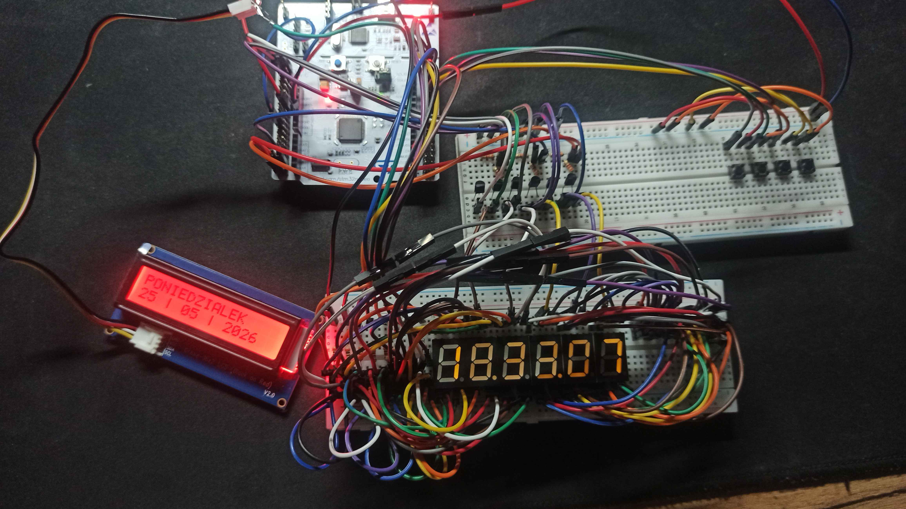
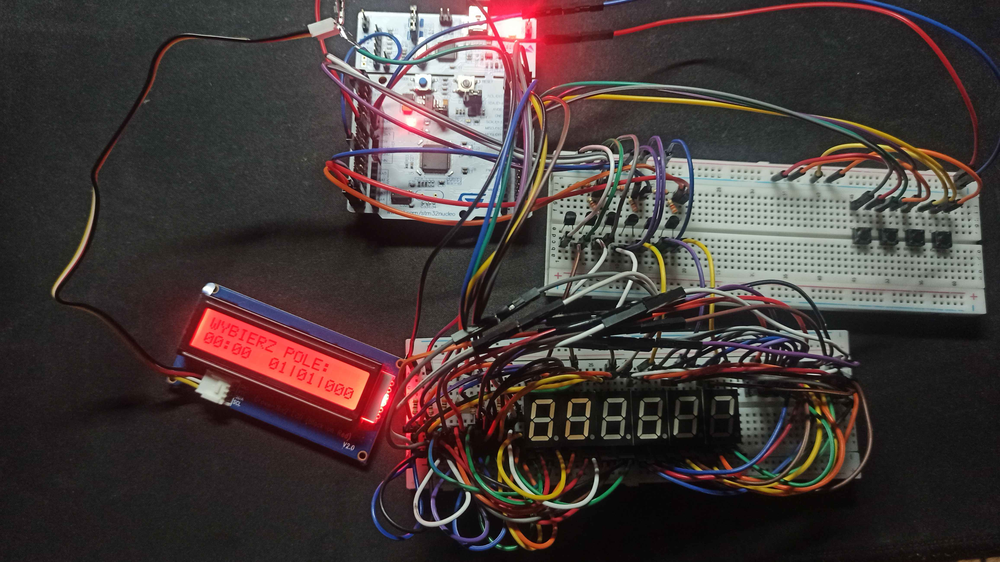
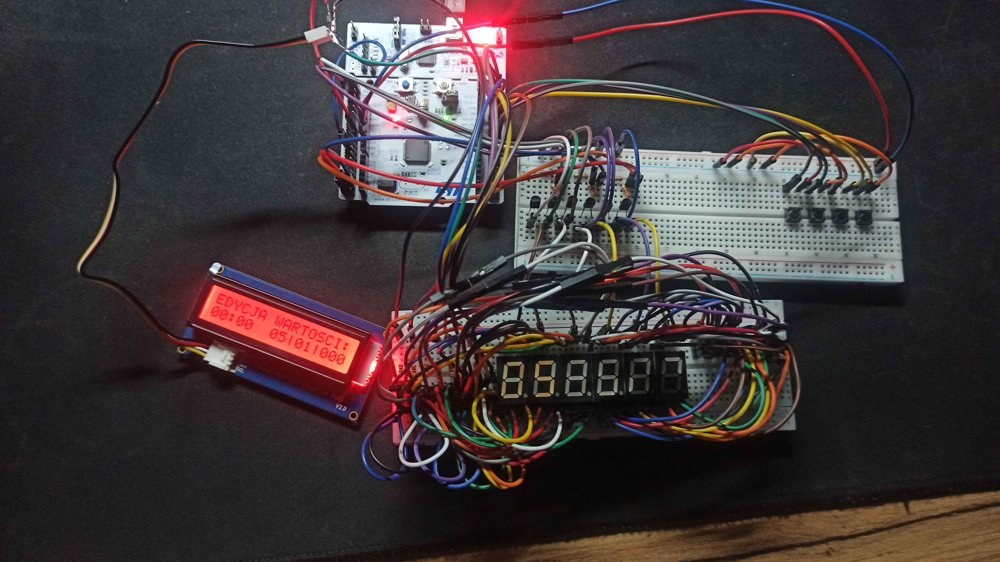

# STM32 RTC Digital Clock

# 1. Project Overview

This project presents the implementation of a digital real-time clock system based on the STM32L476RG microcontroller. The project was developed as an academic assignment for the Microprocessors and Microcontrollers course.

The main goal of the project was to create a functional embedded system capable of measuring and displaying current time and date using the hardware and software capabilities of the STM32 platform.

The system uses the internal RTC (Real-Time Clock) peripheral of the microcontroller to maintain current time and date values. The current time is displayed on six individual 7-segment LED displays in the HH:MM:SS format, while a 16x2 LCD display provides additional information such as the current weekday and full date.

The device also allows manual time and date configuration using four physical buttons. The user interface is implemented using a Finite State Machine (FSM), which manages transitions between normal clock operation, field selection mode, and value editing mode.

The project consist both hardware and software components. The hardware part consists of the STM32 development board, multiplexed 7-segment displays, an I²C LCD module, and user input buttons. The software implementation is responsible for RTC communication, display control, button handling, menu management, and automatic weekday calculation based on the selected date.

# 2. Hardware Architecture

The hardware is built around the STM32L476RG microcontroller. The microcontroller is responsible for maintaining the real-time clock, processing user inputs and controlling both display interfaces.

The prototype consists of the following hardware components:

- STM32 NUCLEO-L476RG development board
- Six individual common-anode 7-segment LED displays
- 16×2 LCD display connected via the I²C interface
- Four tactile push buttons for user interaction
- Six BC557 PNP transistors used for digit switching
- Current-limiting resistors for LED segments
- Base resistors for transistor control

The six 7-segment displays share a common segment bus. Individual digits are enabled by transistor switching, allowing the microcontroller to multiplex all displays while minimizing the number of required GPIO pins.

The LCD module communicates with the microcontroller through the I²C bus and provides additional information that cannot be presented on the 7-segment display, including the current weekday, date and user interface during configuration.

The four push buttons are connected directly to GPIO input pins configured with internal pull-up resistors. They provide navigation through the configuration menu and allow the user to modify time and date settings.

The RTC peripheral is used as the primary timekeeping source. Time and date are maintained by the hardware RTC, while the firmware is responsible for displaying the values, processing user input and calculating the weekday after date modifications.

# 3. Software Architecture

The firmware is implemented as a single procedural application contained in main.c. The software is based on the STM32 HAL library and follows a polling execution model without using an RTOS or interrupts for the application logic.

The program is organized into several logical modules responsible for individual parts of the system:

- system initialization,
- RTC management,
- button handling,
- finite state machine (FSM),
- LCD communication,
- 7-segment display control,
- display multiplexing,
- weekday calculation.

After hardware initialization, the application enters an infinite while(1) loop, where all software components are executed sequentially.

The main execution flow consists of:

- Reading the current RTC time and date.
- Processing user button inputs.
- Updating the finite state machine.
- Refreshing the LCD interface.
- Driving the multiplexed 7-segment display.

This execution model keeps the firmware simple while providing deterministic behaviour suitable for an embedded application of this scale.

## 3.1 Finite State Machine

The user interface is implemented as a finite state machine (FSM) controlling the operating mode of the system. The state machine separates normal clock operation from the configuration process, simplifying user interaction and preventing invalid state transitions.

The firmware operates in three main states:

- **Normal Mode** – displays the current time on the 7-segment displays and the current date with the weekday on the LCD.
- **Field Selection Mode** – allows the user to select which parameter (hours, minutes, day, month or year) will be edited.
- **Value Editing Mode** – allows modification of the selected parameter before saving it to the RTC.

State transitions are triggered exclusively by button events, ensuring deterministic program behaviour.

## 3.2 Button Handling

The system is controlled using four push buttons connected to GPIO input pins.

Each button is periodically polled inside the main program loop. Software debouncing is applied to eliminate false triggering caused by mechanical switch bouncing.

Depending on the current FSM state, the buttons perform different actions such as entering the configuration menu, navigating between editable fields, modifying values and confirming changes.

## 3.3 RTC Management

The application uses the internal STM32 Real-Time Clock (RTC) peripheral to maintain the current time and date.

During normal operation, the firmware periodically reads the RTC registers and updates both display interfaces.

When entering the configuration menu, the current values are copied into temporary variables. This allows the user to modify parameters without immediately affecting the RTC registers. After confirmation, the updated values are written back to the RTC and the weekday is recalculated.

## 3.4 LCD Interface

A 16×2 Grove LCD connected through the I²C interface provides additional textual information.

During normal operation, the display presents the current weekday and calendar date.

When the system enters configuration mode, the LCD changes its content to indicate the currently selected field and displays the edited values, providing visual feedback to the user.

## 3.5 7-Segment Display Control

The current time is presented using six common-anode 7-segment LED displays.

Digit values are converted into individual segment patterns by dedicated display functions, while GPIO outputs control the corresponding LED segments.

During configuration mode, only the currently edited parameter remains visible, making it easier to identify the active field.

## 3.6 Display Multiplexing

To reduce the number of required GPIO pins, all six 7-segment displays share common segment lines.

Only one display is enabled at a time, while the firmware rapidly switches between consecutive digits. The refresh rate is high enough for the human eye to perceive a continuously illuminated display.

The common-anode lines are controlled through transistor switches, while the decimal points are enabled only during normal clock operation.

## 3.7 Weekday Calculation

The weekday is calculated in software whenever the user modifies the calendar date.

The implementation is based on a variation of Zeller's Congruence, allowing the correct weekday to be determined from the entered day, month and year.

The calculated value is written to the RTC together with the updated date, ensuring consistency between the displayed weekday and the stored calendar information.

# 4. Project Demonstration

This section presents the basic workflow of the implemented digital clock.

## 4.1 Normal mode

The default operating mode after startup.

During normal operation:

- the 7-segment displays continuously present the current time (HH:MM:SS),
- the LCD displays the current weekday and full date,
- the RTC peripheral updates the displayed values automatically.

## 4.2 Field Selection Mode

After pressing the Menu button, the system enters configuration mode.

In this mode:

- the user selects which parameter will be edited,
- available fields include hours, minutes, day, month and year,
- only the currently selected pair of digits remains active on the 7-segment display,
- the LCD indicates the currently selected field.

## 4.3 Value Editing Mode

Pressing the Select button enters the editing mode.

During editing:

- the selected value can be increased or decreased,
- changes are stored in temporary variables,
- the RTC is not modified until the user confirms the new value,
- after confirmation, the RTC registers are updated and the weekday is recalculated.

